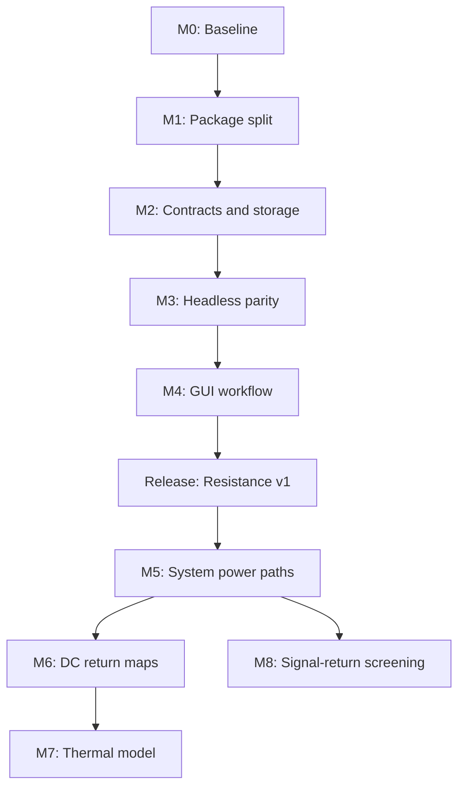
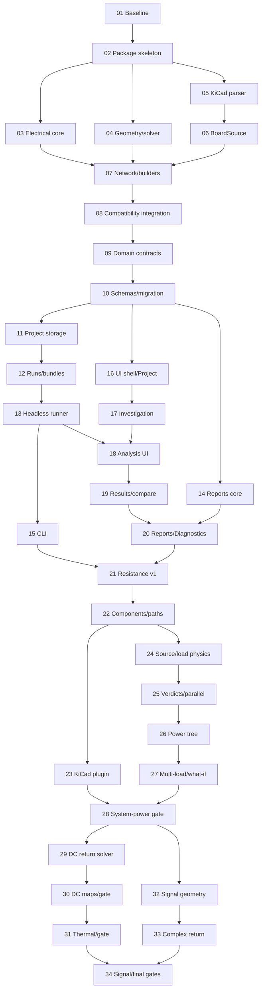

# PathMiner Refactor and Development Plan

**Plan version:** 0.2  
**Date:** 2026-08-26  
**Starting point:** PathMiner v0.13, working single-file application  
**Inputs:** `PathMiner_Project_Specification.md`, `PathMiner_Implementation_Punch_List.md`, and the paired-AI execution requirements

## 1. Plan objective

Refactor the validated v0.13 application into a maintainable PathMiner package, deliver the cleaner Project/Investigation/Analysis/Reports/Diagnostics workflow, and then expand the product into multi-net power-path, DC return, thermal-risk, and signal-return analysis without losing the existing resistance accuracy or CLI automation.

The refactor shall be incremental. Every milestone must leave a runnable program with passing tests. No phase may require a “big-bang” replacement of the current application.

## 2. Planning assumptions

- Work may be executed by ChatGPT or Claude in isolated sessions. Each session has equivalent vendor-specific prompts, but exactly one AI is the implementing writer for that session.
- Parallel work uses dedicated branches/worktrees and starts only from an integrated prerequisite commit. A second model may review a completed session read-only, but may not edit the same session concurrently.
- Model names in this plan are routing recommendations supplied by the project owner. Confirm model availability before launching work; use the documented fallback class when an exact label is unavailable.
- Two-week development sprints are used for planning; no calendar dates are committed until staffing and availability are confirmed.
- SciPy remains optional and opportunistic; the pure-Python fallback remains supported.
- The existing v0.13 results and acceptance boards are the behavioral baseline.
- The first release target is **PathMiner Resistance v1**. System power, DC return, thermal, and signal return are separate gated capabilities.
- UI redesign starts only after the headless domain contracts and storage schemas exist.
- Signal-return work is research/correlation work and is not placed on the same certainty schedule as the resistance refactor.

Estimated effort is expressed as focused engineer-weeks. It excludes organizational delays, unrelated support work, and external correlation-lab scheduling.

## 3. Delivery strategy



The work has three rules:

1. **Mechanical extraction precedes behavior change.** Move code first; redesign it only after parity is proven.
2. **Contracts precede UI.** The GUI consumes stable project, selection, scenario, result, and job objects.
3. **Each new physics capability has its own validation and release gate.** A correct resistance solver does not automatically validate thermal or high-frequency claims.
4. **One session, one writer, one auditable handoff.** Paired ChatGPT and Claude prompts are alternatives; integration sessions own shared façades, registries, and cross-cutting closure.

## 4. Workstreams and Jira epics

| Epic | Workstream | Punch-list families | Primary outcome |
|---|---|---|---|
| **E0** | Baseline and release safety | `BASE`, selected `QA` | Reproducible v0.13 golden baseline |
| **E1** | Package architecture | `ARCH` | Layered package and stable public APIs |
| **E2** | Project data and schemas | `DATA` | Portable `.pathminer/` project data |
| **E3** | Headless analysis and automation | `PWR-001/002`, `AUTO`, selected `QA` | GUI-independent engine, CLI, reports |
| **E4** | UI/UX workflow | `UI` | Project/Investigation/Analysis/Reports/Diagnostics |
| **E5** | System power analysis | `PWR-003` through `PWR-013` | Multi-net source-to-load analysis |
| **E6** | DC return and thermal | `RET` | Current-density, loss, and thermal-risk maps |
| **E7** | Signal-return screening | `SIG` | Geometry and frequency-aware return screening |
| **E8** | Verification and release | `QA` | Per-capability release gates and published confidence |

Suggested Jira hierarchy:

```text
Epic — capability or architectural outcome
  Story — user-visible or API-level behavior
    Task/Subtask — bounded implementation or verification work
```

Punch-list IDs shall be retained in Jira labels or issue descriptions so the plan, specification, and implementation remain traceable.

## 5. Milestone roadmap

### M0 — Freeze and characterize the v0.13 baseline

**Purpose:** Establish a trustworthy point from which all refactoring is measured.  
**Estimated effort:** 0.5–1.0 engineer-week.  
**Dependencies:** None.

Scope:

- Archive the supplied v0.13 tree and reference inputs.
- Record supported CLI commands, defaults, warnings, report fields, and GUI behaviors.
- Run and preserve the canonical 118/118 headless, 284/284 IP5385 real-board, and IP5385 report (1 net, 11 pairs) results.
- Save representative JSON, Markdown, text, and PDF outputs as golden fixtures where stable.
- Add a single command that runs the complete baseline test suite.
- Record current runtime on the IP5385 power-bank board (selftest and batch report).
- Create an architecture decision record explaining the incremental-refactor rule.

Primary punch-list items:

- `BASE-001`, `BASE-002`, `BASE-005`
- `QA-004`, initial `QA-006`

Deliverables:

- Baseline tag/archive.
- Compatibility inventory.
- Golden result fixtures.
- Baseline performance record.
- `ADR-001 Incremental Refactor and Parity Policy`.

Exit criteria:

- Baseline tests pass from a clean environment.
- Golden fixtures can detect a numerical or report-contract change.
- Known nondeterministic fields such as timestamps are normalized or excluded from equality tests.

### M1 — Extract the layered package without changing behavior

**Purpose:** Turn the working script into importable modules while preserving results.  
**Estimated effort:** 2–3 engineer-weeks.  
**Dependencies:** M0.

Extraction sequence:

1. `core/units.py` and `core/materials.py`.
2. `core/geometry.py` and `core/solver.py`.
3. `kicad/sexpr.py`, `kicad/stackup.py`, and `kicad/prefs.py`.
4. `kicad/board.py` behind `BoardSource`.
5. `core/network.py` plus point-to-point, ladder, and mesh builders.
6. `analysis/resistance.py`.
7. Existing report parsing/rendering.
8. UI classes last.

Primary punch-list items:

- `ARCH-001` through `ARCH-004`
- `ARCH-006`, `ARCH-010`
- `BASE-004`
- `PWR-001`

Deliverables:

- Installable `pathminer` package.
- Enforced import-direction test.
- `BoardSource` protocol and `FileBoardSource`.
- Common `ResistorNetwork` and typed result records.
- Compatibility facade preserving existing function/CLI behavior.
- Generated single-file build.

Exit criteria:

- All existing tests pass from the package.
- The generated single-file build passes the same tests.
- Numerical golden results remain within the existing tolerances.
- `core` imports no KiCad, Qt, or file-I/O modules.
- No UI behavior is intentionally changed in this milestone.

### M2 — Define domain contracts and `.pathminer/` storage

**Purpose:** Create the stable data layer needed by both GUI and CLI.  
**Estimated effort:** 2–3 engineer-weeks.  
**Dependencies:** M1.

Scope:

- Define `ProjectContext`, `SelectionModel`, `AnalysisProfile`, `AnalysisScenario`, `AnalysisResult`, `Verdict`, and `JobState`.
- Establish `.pathminer/` directory initialization and discovery.
- Create versioned schemas for project metadata, profiles, selections, and results.
- Import v0.13 net-selection JSON without loss.
- Generate defaults from schemas rather than duplicated constants.
- Implement deterministic JSON formatting, validation, atomic writes, and migration hooks.
- Add provenance and override-source fields.
- Define immutable run ID and manifest behavior.

Primary punch-list items:

- `ARCH-005`, `ARCH-009`
- `DATA-001` through `DATA-004`
- `DATA-007` through `DATA-009`, `DATA-011`
- `QA-002`

Deliverables:

- Domain dataclasses/protocols.
- Project initialization command.
- Versioned schemas and validators.
- v0.13 selection importer.
- Atomic project storage.
- Run manifest prototype.

Exit criteria:

- A v0.13 selection file loads, saves, and reloads without semantic loss.
- GUI-independent tests cover override inheritance and provenance.
- An interrupted write cannot corrupt the previous valid file.
- A completed run can be traced to board/input/tool hashes.

### M3 — Rebuild headless analysis, CLI, jobs, and reporting

**Purpose:** Make the new contracts operational before changing the GUI.  
**Estimated effort:** 2–4 engineer-weeks.  
**Dependencies:** M2.

Scope:

- Move analysis orchestration out of widgets.
- Implement one analysis runner accepting board, selection, profile, and scenario.
- Create solver dispatch and graph/factorization reuse.
- Add the report registry and canonical JSON result.
- Implement the new CLI subcommand skeleton while preserving legacy aliases.
- Define stable exit codes.
- Add the shared job model, progress events, cancellation, and structured diagnostics.
- Add bundle export/import after project files stabilize.

Primary punch-list items:

- `ARCH-007`, `ARCH-008`
- `DATA-010`
- `AUTO-001` through `AUTO-003`, `AUTO-005`, `AUTO-007`
- `QA-003`, `QA-006`

Deliverables:

- Headless resistance-analysis service.
- Canonical `AnalysisResult` JSON.
- Report registry with resistance report.
- CLI subcommands and compatibility aliases.
- Shared job/progress API.
- Analysis-bundle prototype.

Exit criteria:

- A saved GUI-equivalent resistance audit can run without Qt.
- JSON, Markdown, text, and PDF agree on all result values.
- CI distinguishes engineering failure from input or solver errors using exit codes.
- Multiple pad pairs reuse a graph/factorization where applicable.

### M4 — Implement the new application workflow

**Purpose:** Replace tab-specific state with the target information architecture.  
**Estimated effort:** 4–6 engineer-weeks.  
**Dependencies:** M3.

Recommended sequence:

1. Application shell, project header, and shared job bar.
2. Project destination using `ProjectContext`.
3. Investigation browser and shared `SelectionModel`.
4. Analysis Configure/Run and standard result renderer.
5. Manual Estimate combining Trace and Via / Path.
6. Reports as a completed-run consumer.
7. Diagnostics and click-through issues.
8. Compare/What-if baseline structure.

Primary punch-list items:

- `UI-001` through `UI-016`
- `BASE-003`
- `QA-007`

Deliverables:

- `Project | Investigation | Analysis | Reports | Diagnostics` shell.
- Searchable shared scope picker.
- Explicit pair editor.
- Unified manual trace/path editor.
- Unified verdict/result renderer.
- Shared progress and diagnostics.
- Reports with no solver configuration.

Exit criteria:

- Trace and Via / Path capabilities are available without separate primary tabs.
- Net/pad selection made in Investigation persists into Analysis.
- Reports cannot alter analysis inputs or silently rerun.
- Representative-path and network-equivalent results are visibly distinct.
- Current v0.13 workflows remain possible and numerically equivalent.
- Keyboard navigation and non-color status checks pass.

### R1 — PathMiner Resistance v1 release

**Purpose:** Ship a coherent, maintainable resistance product before adding new physics.  
**Estimated stabilization:** 1–2 engineer-weeks.  
**Dependencies:** M0–M4.

Release content:

- Packaged and generated single-file forms.
- Project-local profiles/selections/results.
- New GUI workflow.
- Point-to-point, routed-network, ladder, and mesh resistance.
- Manual estimates, CLI automation, immutable runs, reports, and diagnostics.

Release gate:

- All legacy and new product-flow tests pass.
- Numerical results remain within published tolerances.
- No known silent omissions or invalid-result paths.
- Migration and rollback instructions exist.
- User guide reflects current behavior only.

### M5 — Multi-net system power paths

**Purpose:** Answer complete source-to-load questions across components and nets.  
**Estimated effort:** 4–7 engineer-weeks.  
**Dependencies:** R1.

Scope:

- Captured `REF.PAD` paths and net-drift handling.
- Lean component-model sidecars and project snapshots.
- Component bridge resolution and actionable incomplete-model errors.
- Real source model: OCV, internal resistance, current limit, provenance.
- Constant-current, constant-resistance, and constant-power loads.
- Current-limit application for every load type.
- Multi-reason verdicts, voltage margin, delivered percentage, and budget allocation.
- Parallel branch current sharing and imbalance.
- Thin KiCad path-capture plugin using `LiveKiCadBoardSource`.
- Scenario cloning and electrical what-if comparison.

Primary punch-list items:

- `DATA-005`, `DATA-006`
- `PWR-003` through `PWR-010`, `PWR-013`
- `AUTO-004`
- `QA-001`

Deliverables:

- Path and component-model schemas.
- Multi-net path resolver.
- Source/load operating-point solver.
- Verdict and margin renderer.
- KiCad path-capture plugin.
- Power-path report.

Exit criteria:

- A captured source-to-load path reruns after board rerouting using stable identifiers.
- Missing bridges block analysis with a complete fix list.
- Analytic load/source/current-limit tests pass.
- Parallel branch currents, loss, and imbalance agree with nodal solutions.
- GUI and CLI report the same simultaneous failure reasons.

### M5B — Simultaneous power tree

**Purpose:** Move from individual paths to shared-network operating states.  
**Estimated effort:** 3–6 engineer-weeks.  
**Dependencies:** M5.

Scope:

- Power-tree discovery and editable source/conversion/load relationships.
- Multiple enabled loads and operating states.
- Shared-edge current and voltage solution.
- Nonlinear iteration for constant-power loads where required.
- Power-tree view and branch scoping.

Primary punch-list items:

- `PWR-011`, `PWR-012`

Exit criteria:

- Shared copper reflects combined load current.
- KCL and energy-balance checks pass.
- Solver convergence and nonlinear assumptions are reported.

### M6 — DC ground-return and power-loss maps

**Purpose:** Solve return current across real ground geometry and expose bottlenecks.  
**Estimated effort:** 6–10 engineer-weeks.  
**Dependencies:** M5B and validated mesh infrastructure.

Scope:

- Return-terminal identification from component models.
- Multi-layer ground/reference mesh from actual filled copper.
- Slots, voids, antipads, clearances, and via connectivity.
- Simultaneous signed current injection and KCL validation.
- Edge/cell current density.
- Voltage-gradient and `I²R` power-loss maps.
- Spatial map file format and PCB overlay.
- Mesh convergence and external correlation cases.

Primary punch-list items:

- `RET-001` through `RET-006`, `RET-010`
- `QA-005`, `QA-008`

Deliverables:

- DC return solver.
- Voltage/current-density/power-loss map arrays.
- Layer and combined-board overlays.
- Conservation and mesh-refinement reports.

Exit criteria:

- Signed injections sum to zero within tolerance.
- Integrated cell power matches total network loss within tolerance.
- Analytic plane/constriction cases pass.
- Published correlation bounds exist.
- Output is labeled independently from temperature.

### M7 — Board thermal and electrothermal analysis

**Purpose:** Convert electrical loss into defensible temperature estimates.  
**Estimated effort:** 6–12 engineer-weeks plus correlation time.  
**Dependencies:** M6.

Scope:

- Preserve scoped IPC trace-rise calculation.
- Create a board thermal-resistance/finite-difference network.
- In-plane and through-board conduction.
- Convection boundary conditions and optional component heat sources.
- Temperature-dependent copper resistance iteration.
- Thermal confidence/limitations and correlation.

Primary punch-list items:

- `RET-007` through `RET-009`

Exit criteria:

- Energy balance closes within defined tolerance.
- Electrothermal iterations converge or fail explicitly.
- Results are correlated against analytic/reference/measured cases.
- IPC isolated-trace output and board thermal output cannot be confused.

### M8 — Signal-return screening and correlation

**Purpose:** Identify return-path discontinuities and develop a frequency-aware model without overstating accuracy.  
**Estimated effort:** 8–16 engineer-weeks plus field-solver correlation; treat as research range.  
**Dependencies:** M5; M6 geometry infrastructure is strongly preferred.

Subphase A — geometry screening:

- Signal-channel schema.
- Reference-plane selection along a route.
- Plane split/void/cutout detection.
- Layer-transition analysis and nearest return via/capacitor.
- Detour and transition-risk reporting.

Subphase B — impedance screening:

- Frequency-aware R/L/C edges.
- Capacitor and via impedance.
- Complex nodal solution.
- Normalized-port and actual-spectrum excitation modes.

Subphase C — correlation:

- PEEC/mutual coupling or external field-solver workflow.
- Solid-plane, slot, stitching-via, and stitching-capacitor test structures.
- Published accuracy/frequency/geometry domain.

Primary punch-list items:

- `SIG-001` through `SIG-009`

Exit criteria:

- Geometry screening links every issue to a board location.
- Frequency-aware results pass analytic R/L/C tests.
- Localized return-current claims remain Screening until correlation passes.
- Reports state frequency, excitation, model, and confidence.

## 6. Immediate implementation tranche

The first tranche should stop after M1. It creates a safe foundation without mixing UI redesign or new physics into the extraction.

### Sprint 1 — Baseline and package skeleton

- [ ] Archive/tag v0.13 and reference data (`BASE-001`).
- [ ] Capture compatibility inventory (`BASE-002`).
- [ ] Record golden outputs and performance (`QA-004`, `QA-006`).
- [ ] Add package skeleton and `pyproject.toml` (`ARCH-001`).
- [ ] Add import-boundary test (`ARCH-002`).
- [ ] Establish aggregate test command and CI job.

**Sprint demonstration:** clean checkout runs the original app and complete baseline suite; empty package imports successfully.

### Sprint 2 — Pure core extraction

- [ ] Extract units and material constants.
- [ ] Extract trace/via formulas.
- [ ] Extract geometry helpers.
- [ ] Extract dense, CG, and optional SciPy solvers.
- [ ] Move corresponding tests while retaining vector IDs.
- [ ] Confirm the original entry point calls the extracted functions.

**Sprint demonstration:** the original GUI/CLI runs using the new `core` modules with identical numerical outputs.

### Sprint 3 — KiCad and board abstraction

- [ ] Extract S-expression parser, stackup, and preferences.
- [ ] Define `BoardSource` and `FileBoardSource`.
- [ ] Add stable `pad("REF.PAD")` lookup.
- [ ] Extract board geometry and pour parsing.
- [ ] Move real-board regression tests.

**Sprint demonstration:** board parsing, stackup output, terminal lookup, and existing routed-net tests pass through `FileBoardSource`.

### Sprint 4 — Common network and builders

- [ ] Define common node/edge/network/result objects.
- [ ] Adapt point-to-point builder.
- [ ] Adapt ladder builder.
- [ ] Adapt mesh builder.
- [ ] Route all three through one solver dispatcher.
- [ ] Add generated single-file build prototype.

**Sprint demonstration:** the package and generated file reproduce the v0.13 reference and real-board results.

### Recommended pull-request boundaries

1. **PR-01:** Baseline fixtures, CI, and package skeleton.
2. **PR-02:** Units/materials and trace/via calculations.
3. **PR-03:** Geometry and solver extraction.
4. **PR-04:** KiCad S-expression, stackup, and preferences.
5. **PR-05:** `BoardSource` and board parser.
6. **PR-06:** Common network and three builders.
7. **PR-07:** Compatibility facade and generated single-file build.

Each PR shall be reviewable independently and shall not combine mechanical movement with intentional numerical changes.

## 7. Dependency rules

| Work | Must wait for | Reason |
|---|---|---|
| New primary navigation | Domain contracts and headless runner | Prevent widget state from becoming the new API |
| KiCad plugin | `BoardSource` and path schema | Prevent a forked parser/solver |
| Component model library | Project-local component schema | Preserve reproducibility |
| Multi-net power tree | Individual source/load path model | Validate operating-point behavior first |
| DC return | Simultaneous operating scenario and mesh | Return injections must come from solved loads |
| Board temperature | Conserved power-loss map | Temperature cannot precede validated heat sources |
| Frequency-aware return | Channel schema and reference geometry | Excitation and reference path must be explicit |
| Localized HF return claims | PEEC/field-solver correlation | Plain plane impedance is insufficient |

## 8. Architecture decisions to close early

These decisions should become short architecture decision records during M0–M2.

| ADR | Recommended decision |
|---|---|
| **ADR-001** | Incremental extraction; every milestone remains runnable. |
| **ADR-002** | Stable top-level convenience API plus richer dataclasses in documented submodules. |
| **ADR-003** | SciPy optional; pure-Python fallback required. |
| **ADR-004** | JSON Schema Draft-07 retained for initial compatibility; schema major versions control future migration. |
| **ADR-005** | Project-local `.pathminer/` JSON is authoritative; databases are regenerable caches or upstream sources only. |
| **ADR-006** | `REF.PAD` is the stable design identifier; net name is drift validation. |
| **ADR-007** | Canonical JSON `AnalysisResult`; all reports are renderings. |
| **ADR-008** | Reports consume immutable runs and never trigger an implicit solve. |
| **ADR-009** | Signal-return results remain Screening until correlation gate passes. |
| **ADR-010** | Compiled acceleration is introduced only behind stable APIs after profiling. |

## 9. Verification plan by milestone

| Milestone | Required verification |
|---|---|
| M0 | Existing self-tests, golden outputs, baseline runtime |
| M1 | Module tests, import-boundary test, package/single-file parity |
| M2 | Schema validation, migration, round-trip, atomic-write tests |
| M3 | End-to-end headless run, renderer equality, exit codes, cancellation |
| M4 | GUI workflow, selection persistence, result consistency, accessibility |
| R1 | Full regression, migration rehearsal, packaging on target operating systems |
| M5 | Analytic source/load/limit/bridge/parallel tests, net-drift scenarios |
| M5B | KCL, shared-edge currents, nonlinear convergence, energy balance |
| M6 | Analytic sheets/constrictions, mesh refinement, current/power conservation |
| M7 | Thermal analytic cases, energy balance, electrothermal convergence, correlation |
| M8 | R/L/C analytic tests and external field-solver correlation structures |

## 10. Risk register

| ID | Risk | Impact | Mitigation / gate |
|---|---|---|---|
| **R-01** | Numerical drift during package extraction | Loss of trusted baseline | Golden vectors and outputs on every extraction PR |
| **R-02** | UI redesign begins before domain contracts | New coupling and rework | M3 is a hard predecessor to M4 |
| **R-03** | Schema and defaults diverge | GUI/CLI produce different results | Generate defaults from schemas |
| **R-04** | Plugin becomes a second implementation | Behavior drift and maintenance burden | `BoardSource` first; thin plugin only |
| **R-05** | Large-net batch performance becomes unacceptable | Poor usability/CI runtime | Factor graph once, reuse factorization, benchmark budgets |
| **R-06** | Component values lack conditions/provenance | Plausible but wrong system results | Missing/ambiguous models block analysis |
| **R-07** | Project data depends on a private global database | Runs cannot be shared or reproduced | Snapshot resolved models into project/run |
| **R-08** | Generated files create Git noise | Merge conflicts and user frustration | Commit inputs; ignore generated outputs by default |
| **R-09** | DC heat-source map is presented as temperature | Engineering misuse | Separate result types and confidence labels |
| **R-10** | Signal-return heuristic is treated as signoff | Incorrect design conclusions | Screening label and external-correlation release gate |
| **R-11** | Scope expands before Resistance v1 ships | Refactor never stabilizes | R1 is a formal release boundary |
| **R-12** | C/C++ rewrite consumes effort without product gain | Schedule and portability loss | Profile first; preserve API/fallback |

## 11. Development governance

### 11.1 Pull-request policy

- One bounded architectural or behavioral outcome per PR.
- Mechanical extraction and intentional result changes are separate PRs.
- All applicable tests pass before merge.
- Public API/schema changes include compatibility notes and tests.
- User-visible behavior changes update `documents/change_log.md`.
- Documentation describes current behavior; future behavior remains in this plan/specification.
- No numerical-default change is accepted without an explicit rationale and golden-output review.

### 11.2 Definition of done for a story

A story is done only when:

- Acceptance criteria pass.
- Unit and integration tests exist.
- Failure behavior is tested, not just the success path.
- CLI and GUI use the same underlying contract where both apply.
- Units, provenance, confidence, and limitations are visible in results.
- Documentation and change log are updated if behavior changed.
- No new import-boundary violation exists.
- Performance impact is measured for solver or board-parser changes.

### 11.3 Review cadence

- **Sprint planning:** select only work whose dependencies are complete.
- **Weekly technical review:** numerical changes, schema decisions, and risks.
- **Sprint demonstration:** runnable workflow and acceptance results, not code volume.
- **Release review:** capability-specific gate and confidence label.

## 12. Progress reporting

Use a compact milestone dashboard:

| Milestone | Status | Completed / total | Gate | Primary blocker |
|---|---|---:|---|---|
| M0 Baseline | Not started | 0 / 5 | Baseline reproducible | — |
| M1 Package split | Not started | 0 / 7 PRs | Package/single-file parity | M0 |
| M2 Contracts/storage | Not started | 0 / TBD | Schema round-trip | M1 |
| M3 Headless parity | Not started | 0 / TBD | GUI-independent run | M2 |
| M4 GUI workflow | Not started | 0 / TBD | End-to-end UI parity | M3 |
| R1 Resistance v1 | Not started | 0 / TBD | Release checklist | M4 |
| M5 System power | Not started | 0 / TBD | Analytic operating points | R1 |
| M6 DC return | Not started | 0 / TBD | Current/power conservation | M5B |
| M7 Thermal | Not started | 0 / TBD | Correlation | M6 |
| M8 Signal return | Not started | 0 / TBD | Screening/correlation gate | M5/M6 |

Do not report percentage complete from effort estimates alone. Report completed acceptance items and release-gate status.

## 13. First planning checkpoint

Before the first refactor PR, confirm:

- The v0.13 source tree and the IP5385 KiCad project (committed to ai_reference/kicad_project_example/) are the approved baseline.
- The supported Python versions and three target operating systems.
- Whether `pytest` and `pyproject.toml` packaging are acceptable for the refactor.
- The stable top-level public API recommendation in ADR-002.
- The location of the external Git repository, if this scratch copy is not the working repository.
- Who performs electrical-domain review for source/load, return-path, and thermal models.
- Which listed ChatGPT and Claude model labels are actually available in each execution environment.
- The coordinator who alone marks sessions integrated and updates the shared status ledger.

These items do not block drafting or test-fixture preparation, but they should be closed before structural commits begin.

## 14. Recommended next action

Begin **Session 01 only**, using either its ChatGPT prompt or its Claude prompt:

1. Assign one implementing AI and record the unused paired prompt as an alternative.
2. Establish the approved v0.13 baseline, immutable baseline commit, and clean test command.
3. Capture compatibility, golden outputs, expected acceptance counts, and performance measurements.
4. Produce the required handoff and have the coordinator integrate it.
5. Open Session 02 only from that integrated commit.

This creates a reversible, evidence-backed starting point. The session DAG in Section 15 replaces calendar-driven assignment and allows safe parallel work only where file ownership is disjoint.

<!-- AI_SESSION_PLAN_START -->
## 15. Multi-model session execution plan

### 15.1 Operating model

- Each numbered session has one ChatGPT prompt and one Claude prompt. They specify the same objective, scope, prerequisites, tests, and handoff; their model settings differ.
- The two prompts are **alternative executors**. Assign exactly one implementing writer. The unused model may review the finished diff read-only.
- Every session runs in `ai/session-<NN>-<ai>-<slug>` from a coordinator-approved integrated prerequisite commit.
- Parallel work is allowed only for disjoint write scopes. Sessions 03/04/05, 11/14/16, 15/18, 23/24, and 29/32 are the planned parallel opportunities; the coordinator must still check actual file ownership.
- Sessions 08, 21, 28, 30/31, and 34 are integration or capability-gate sessions. They own the shared façade/registry/release reconciliation named in their prompt.
- The exact model labels below are recommendations based on task risk. Confirm availability when assigning. For unavailable labels, record a coordinator-approved equal-or-stronger substitution rather than silently changing routing.

ChatGPT effort values use `light | medium | high | extra high | max`; Claude uses `low | medium | high | extra | max`. ChatGPT speed is always stated as `standard` or `fast` in the prompt header. Spaces in model/effort labels are hyphenated in filenames, and the requested filename omits speed, so speed is not encoded there.

### 15.2 Session catalog and routing

| # | Session | Wave | Depends on | Closure ownership | ChatGPT model / speed / effort | Claude model / effort |
|---:|---|---|---|---|---|---|
| 01 | Baseline freeze and compatibility inventory | W0 | None | BASE-001, BASE-002 | `5.6-luna` / fast / medium | `Haiku-4.5` / medium |
| 02 | Package and CI skeleton | W1 | Session 01 | ARCH-001, ARCH-002 | `5.6-terra` / fast / high | `Sonnet-4.6` / high |
| 03 | Units, materials, trace and via extraction | W2-A | Session 02 | PWR-001 | `5.6-sol` / standard / high | `Sonnet-5` / high |
| 04 | Geometry and numerical backend extraction | W2-B | Session 02 | BASE-005 | `5.6-sol` / standard / extra high | `Opus-4.8` / extra |
| 05 | KiCad syntax, stackup and preferences extraction | W2-C | Session 02 | capability-gate slice | `5.6-terra` / fast / high | `Sonnet-4.6` / high |
| 06 | BoardSource and file-backed board model | W3 | Session 05 | ARCH-003 | `5.6-sol` / standard / high | `Sonnet-5` / high |
| 07 | Common network, builders and model-selection policy | W4 | Session 03, Session 04, Session 06 | ARCH-004 | `5.6-sol` / standard / max | `Opus-4.8` / extra |
| 08 | Compatibility integration and single-file build | W5 | Session 03, Session 04, Session 07 | BASE-004, ARCH-006, ARCH-010 | `5.6-sol` / standard / high | `Sonnet-5` / high |
| 09 | Shared domain contracts | W6 | Session 08 | ARCH-005 | `5.6-sol` / standard / extra high | `Opus-4.8` / high |
| 10 | Schemas, defaults and migration | W7 | Session 09 | ARCH-009, DATA-002, DATA-003, QA-002 | `5.6-sol` / standard / high | `Sonnet-5` / high |
| 11 | Project storage, identifiers, provenance and atomic writes | W8-A | Session 10 | DATA-001, DATA-004, DATA-007, DATA-008, DATA-009 | `5.6-terra` / standard / high | `Sonnet-5` / high |
| 12 | Immutable runs and portable analysis bundles | W9-A | Session 11 | DATA-010, DATA-011 | `5.6-terra` / fast / high | `Sonnet-4.6` / high |
| 13 | Headless runner, jobs and factorization reuse | W10 | Session 07, Session 09, Session 12 | ARCH-007 | `5.6-sol` / standard / max | `Opus-4.8` / extra |
| 14 | Report registry and canonical result renderers | W8-B | Session 09, Session 10 | ARCH-008, AUTO-003, AUTO-005 | `5.6-terra` / standard / high | `Sonnet-5` / high |
| 15 | CLI, exit codes and CI examples | W11-A | Session 13, Session 14 | AUTO-001, AUTO-002, AUTO-007 | `5.6-terra` / fast / high | `Sonnet-4.6` / high |
| 16 | Application shell, Project destination and shared status | W8-C | Session 09, Session 10 | UI-001, UI-002, UI-003, UI-004, UI-015 | `5.6-sol` / standard / high | `Sonnet-5` / high |
| 17 | Investigation, shared scope and explicit pairs | W9-B | Session 16 | UI-005, UI-006, UI-007, UI-016 | `5.6-sol` / standard / high | `Sonnet-5` / high |
| 18 | Analysis configuration and path unification | W11-B | Session 13, Session 16, Session 17 | UI-008, UI-009, UI-010, UI-011 | `5.6-sol` / standard / max | `Opus-4.8` / extra |
| 19 | Reusable results and compare/what-if UI | W12 | Session 18 | UI-012 | `5.6-sol` / standard / high | `Fable-5` / high |
| 20 | Reports, Diagnostics and diagnostic bundles | W13 | Session 14, Session 16, Session 17, Session 19 | UI-013, UI-014, AUTO-006 | `5.6-terra` / standard / high | `Sonnet-5` / high |
| 21 | Resistance v1 integration and release gate | W14 | Session 15, Session 18, Session 20 | BASE-003, PWR-002, QA-003, QA-004, QA-005, QA-006, QA-007 | `5.5` / standard / max | `Opus-4.8` / max |
| 22 | Component sidecar, snapshots and captured paths | W15 | Session 21 | DATA-005, DATA-006, PWR-003, PWR-004 | `5.6-sol` / standard / extra high | `Opus-4.8` / high |
| 23 | Thin KiCad capture plugin | W16-A | Session 22 | AUTO-004 | `5.6-terra` / fast / high | `Sonnet-4.6` / high |
| 24 | Source, load and current-limit physics | W16-B | Session 22 | PWR-005, PWR-006, PWR-007 | `5.5` / standard / max | `Opus-4.8` / max |
| 25 | Verdicts, margins and parallel branches | W17 | Session 24 | PWR-008, PWR-009, PWR-010 | `5.5` / standard / max | `Opus-4.8` / max |
| 26 | Power-tree structure and investigation integration | W18 | Session 22, Session 25 | PWR-011 | `5.6-sol` / standard / extra high | `Opus-4.8` / high |
| 27 | Simultaneous multi-load solve and what-if | W19 | Session 25, Session 26 | PWR-012, PWR-013 | `5.5` / standard / max | `Opus-4.8` / max |
| 28 | System-power release gate | W20 | Session 23, Session 27 | capability-gate slice | `5.5` / standard / max | `Opus-4.8` / max |
| 29 | DC return geometry, mesh, injections and solve | W21-A | Session 28 | RET-001, RET-002, RET-003, RET-004 | `5.5` / standard / max | `Opus-4.8` / max |
| 30 | DC return metrics, maps and release evidence | W22-A | Session 29 | RET-005, RET-006 | `5.5` / standard / max | `Opus-4.8` / max |
| 31 | Thermal, electrothermal and correlation gate | W23-A | Session 30 | RET-007, RET-008, RET-009, RET-010 | `5.5` / standard / max | `Opus-4.8` / max |
| 32 | Signal-channel geometry screening | W21-B | Session 28 | SIG-001, SIG-002, SIG-003, SIG-007 | `5.6-sol` / standard / extra high | `Opus-4.8` / high |
| 33 | Complex signal-return network and coupling | W22-B | Session 32 | SIG-004, SIG-005, SIG-006 | `5.5` / standard / max | `Opus-4.8` / max |
| 34 | Signal overlays, field-solver correlation and final gates | W24 | Session 31, Session 33 | SIG-008, SIG-009, QA-001, QA-008, QA-009 | `5.5` / standard / max | `Opus-4.8` / max |

### 15.3 Planned parallel waves



### 15.4 Punch-list closure semantics

The session catalog distinguishes whole-item closure from contribution. The prompt's **Closure owner** may close the item only after its original Done-when clause is demonstrated. Items shown as contributions remain open. `QA-001`, `QA-008`, and `QA-009` are living controls: capability sessions add evidence, and Session 34 is their final cross-project closure owner.

### 15.5 Required handoff and status controls

Every writer produces Markdown and schema-validated JSON handoffs containing the base/final commits, branch, punch status, files, APIs/schemas, exact tests and results, decisions, deviations, known failures, and downstream impact. Only the coordinator marks `INTEGRATED` in `SESSION_STATUS.csv`. Dependent work may not begin from a merely completed or reviewed branch.

### 15.6 Model-routing rationale

- `5.6-luna` / `Haiku-4.5`: inventory, bounded mechanical checks, and low-coupling documentation.
- `5.6-terra` / `Sonnet-4.6` or `Sonnet-5`: package extraction, storage, CLI, reports, and bounded UI work.
- `5.6-sol` / `Opus-4.8`: contracts, shared state, solvers, complex integration, and numerical debugging.
- `5.5` / `Opus-4.8` at max effort: nonlinear/multiphysics analysis, correlation, and release-gate integration.
- `Fable-5` is assigned to a bounded result-presentation/compare session and is also suitable for UX/specification review; it is not routed to safety-critical solver or schema ownership.
<!-- AI_SESSION_PLAN_END -->
